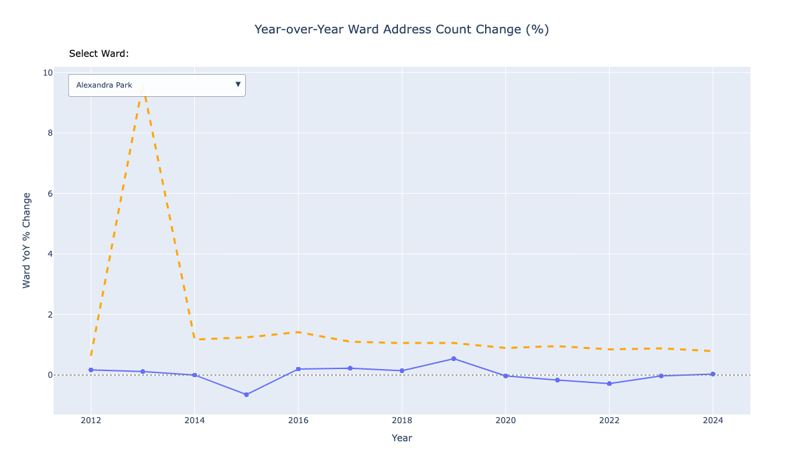

# London Address Data Analysis (2011-2024)

## 📊 Overview

This notebook agregates London residential address data from 2011 to 2024, examining address count changes at both Output Area (OA) and  Ward  levels. The analysis includes:

## 🎯 Key Features

- **Spatial Analysis**: Linking address points to Output Areas and Wards using geometric spatial joins
- **Temporal Analysis**: Year-over-year percentage changes in address counts across the study period
- **Interactive Visualisations**: Plotly charts with dropdown selections for exploring trends across different areas

*Interactive chart showing year-over-year ward address count changes with dropdown selection for different London wards*
- **Statistical Analysis**: statistics on address count changes, volatility, and consistency measures

## 📁 Data Sources

### Primary Datasets
- **AddressBase Premium**: Residential addresses (2011-2024) - Ordnance Survey premium address dataset
- **Output Areas 2021**: Geographic boundaries for England and Wales - Office for National Statistics
- **LOAC Lookup**: London Output Area Classification table for filtering London areas
- **Ward Lookup**: Output Area to Ward mapping (2024) - Office for National Statistics

##  Quick Start

### Installation

Clone the repository and install locally:

bash
git clone 
cd gsscoder_python
pip install -r requirements.txt

---

## 🤝 Contributing

We welcome contributions! Please feel free to:
- 🐛 Report bugs
- 💡 Suggest features  
- 📝 Improve documentation
- 🔧 Submit pull requests

---

## 📫 Contact

For questions or feedback, please reach out to [sebastian.heslin-rees@london.gov.uk].

---

## 📄 License
Shield: [![CC BY-NC 4.0][cc-by-nc-shield]][cc-by-nc]

This work is licensed under a
[Creative Commons Attribution-NonCommercial 4.0 International License][cc-by-nc].

[![CC BY-NC 4.0][cc-by-nc-image]][cc-by-nc]

[cc-by-nc]: https://creativecommons.org/licenses/by-nc/4.0/
[cc-by-nc-image]: https://licensebuttons.net/l/by-nc/4.0/88x31.png
[cc-by-nc-shield]: https://img.shields.io/badge/License-CC%20BY--NC%204.0-lightgrey.svg

please email [sebastian.heslin-rees@london.gov.uk] for license infomation.