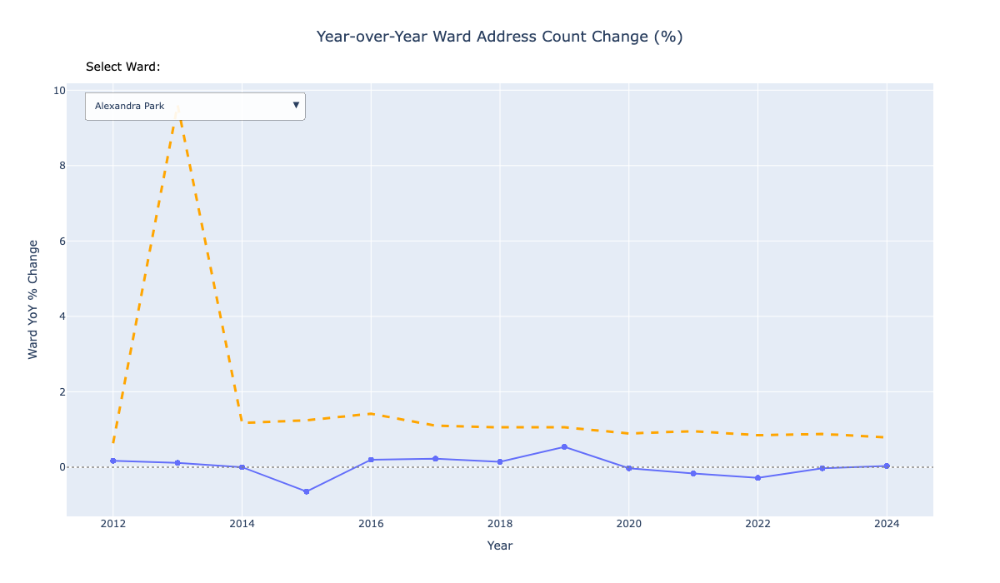
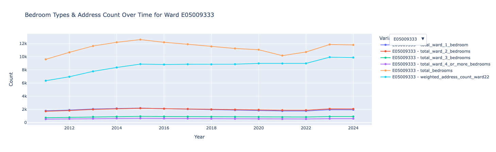
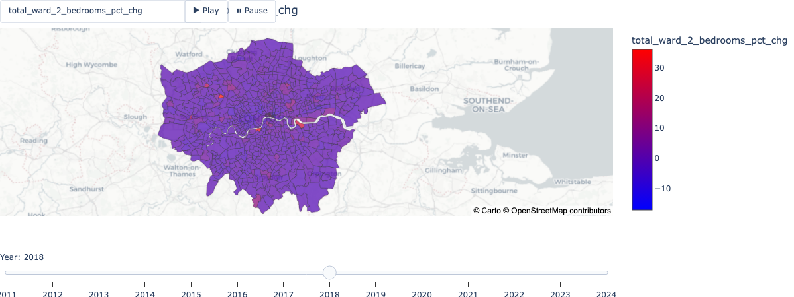
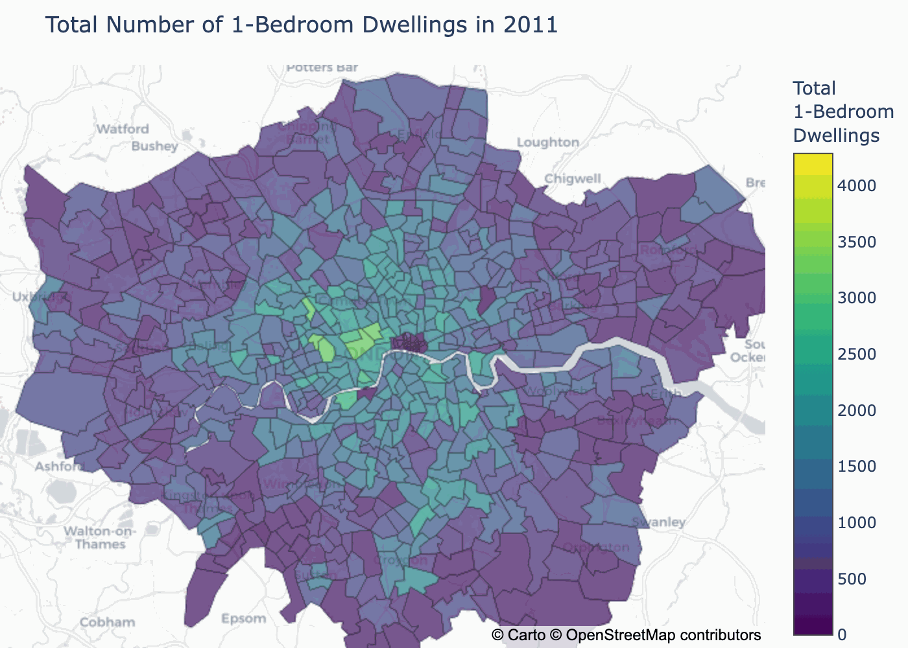
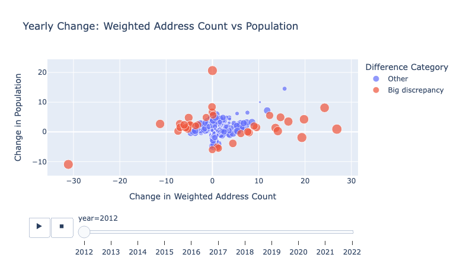
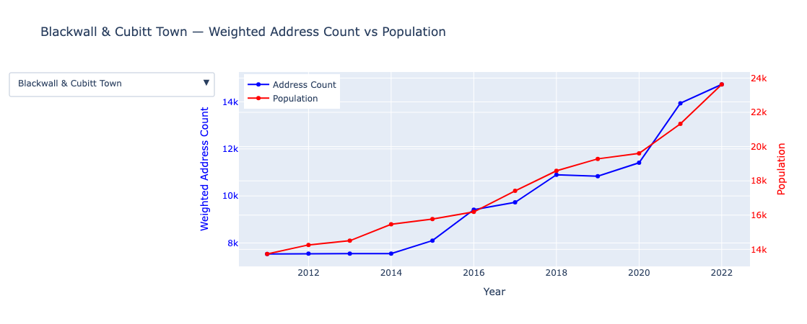
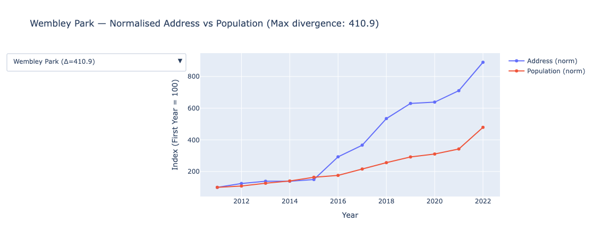
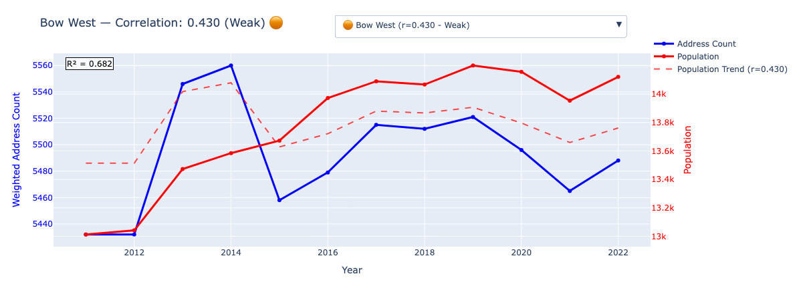

# Recoding address data and producing bedroom estimates timeseires for London (2011-2024)

## 📊 Overview

This repository contains 5 notebooks:

1. **recoding_address.ipynb** - Aggregates AddressBase Premium point data to Output Areas and Wards using weighted spatial joins.
   Creates annual address count time series with year-over-year change calculations and interactive visualisations.

2. **estimate_bedroom_count.ipynb** - Estimates bedroom type count (1, 2, 3 bedrooms etc) at ward 2022 level, using 2011/2021 census data as anchor points based on address data.
   Uses spline interpolation and ratio preservation to estimate bedroom counts for non-census years at ward level.

3. **compare_to_old_unit_data.ipynb** - Validates new address data against existing backseries dwellings housing unit datasets at LSOA level.
   Performs correlation analysis to identify areas with divergent trends and assess data reliability.

4. **LBSM_analysis.ipynb** - Compares address counts with London Building Stock Model (LBSM) UPRN data.
   Analyses systematic differences between datasets and establishes correlation patterns for quality assurance.

5. **comparing_output_to_population_timeseries.ipynb** - Compare population estimates to address counts


## 📓 Notebooks

### 1. `recoding_address.ipynb`
**Purpose**: Main address data processing pipeline - aggregates AddressBase Premium data to Output Areas and Wards
- **Key Processes**:
  - Spatial joining of address points to Output Area polygons
  - Multi-year processing (2011-2024) with coordinate reference system alignment
  - Geographic aggregation from Output Areas to Ward level with weighted allocation
  - This is preformed using a weighting lookup so that oa that boarder wards the addresses are split relative to the proportion the oa sit in the respective wards instead of just using where the population weight centroid is, to improve accucary
  - Year-over-year percentage change calculations
  - Interactive visualisations with Plotly dropdown menus for wards
  
- **Outputs**: 
  - `oa_address_counts.csv` - Complete address time series by geography
  - Ward-level address count trends and statistics

### 2. `estimate_bedroom_count.ipynb`
**Purpose**: Produc bedroom estimates and using census data and spline interpolation of address data 
- **Key Processes**:
  - Processing 2011 & 2021 census bedroom data at Output Area level
  - Weighted aggregation to Ward 2022 boundaries 
  using the proccess describe above
  - Spline-based interpolation of address counts with linear ratio interpolation for bedroom types
  - Quality control, logging of problematic wards
  - Interative line plot
    
  bedroom_estimate_plot
  - Interactive temporal mapping 
   
  
- **Methodology**: 
  - Uses census years as anchor points with UnivariateSpline fitting
  - Preserves bedroom-to-address ratios through linear interpolation
  - Includes smoothing parameter analysis (`s=0.1` for interpolation)
- **Outputs**: 
  - `bedroom_count_ward22.csv` - Complete bedroom time series by ward (2011-2024)


## Three Validation Notebooks

### 3. `compare_to_old_unit_data.ipynb`
**Purpose**: Validation study comparing new address data with existing housing unit datasets
- **Key Processes**:
  - Imports legacy housing unit data from R (.rds) files at LSOA level
  - Aggregates new address data to LSOA level for direct comparison
  - Statistical correlation analysis between address counts and housing units
  - Identification of areas with low correlation for further investigation
  - Interactive visualisation of address vs. unit trends by LSOA
- **Validation Results**:
    - Dataset seem to compare well (strong correlations)
  - Analysis of correlation patterns across London's LSOAs
  - Identification of potential problematic areas with divergent trends
  - Quality assurance metrics for address count reliability

### 4. `LBSM_analysis.ipynb`
**Purpose**: Comparative analysis with London Building Stock Model (LBSM) data
- **Key Processes**:
  - Downloads and processes LBSM data from London Datastore API
  - Compares UPRN counts from LBSM (2017) with address counts (2023)
  - Correlation analysis and distribution comparisons
- **Key Findings**:
  - Strong correlation (0.72) between LBSM UPRNs and address counts
  - UPRN counts systematically higher (~38% on average)
  - 90.7% data coverage overlap between datasets
  - Identifies systematic differences due to data collection methods and temporal gaps

### 5. `comparing_output_to_population_timeseries.ipynb`
**Purpose**: Validation analysis comparing address count estimates against official population estimates at ward level
- **Key Processes**:
  - Integration of ONS population estimates (2021-based) with bedroom count time series data
  - Correlation coefficient analysis between weighted address counts and population trends
  - Year-over-year percentage change calculations for both address counts and population
  - Identification of wards with weak correlations (|r| < 0.3) flagged as potentially problematic areas
  - Interactive dropdown menus with correlation strength categorisation (Strong/Moderate/Weak/Very Weak)
  - Normalised trend analysis to compare relative growth patterns regardless of absolute values
- **Key Visualisations**:
  - Bubble plot: percentage change in addresses vs percentage change in population (large differences highlighted in red)
    
  - Address count vs population comparison plots:
    - (a) Time series line graphs with dual y-axes
    - (b) Normalised divergence plot showing relative growth patterns  
    - (c) Correlation coefficient analysis by ward
    
    
    
- **Outputs**: 
  - Correlation summary statistics across all London wards
  - List of wards with very weak correlations requiring further investigation
  - Interactive visualisations for individual ward trend analysis
  - Data quality assessment metrics for interpolation validation

## 📁 Data Sources

### Primary Datasets
- **AddressBase Premium**: Residential addresses (2011-2024) - Ordnance Survey premium address dataset
- **Census 2011 & 2021**: Bedroom count data by Output Area - Office for National Statistics
- **Output Areas 2021**: Geographic boundaries for England and Wales - Office for National Statistics
- **LOAC Lookup**: London Output Area Classification table for filtering London areas
- **Ward Lookup**: Output Area to Ward mapping (2024) - Office for National Statistics
- **LBSM API**: London Building Stock Model for additional property characteristics
- **Weighted lookup**: lookup to weighted output areas to ward but give the pecentage of the oa in the the repective wards thus any value of the oa can be proportional to this for greater accuracy
- **ONS population estimates**: Population estimates to check change in addresses against population


## 🚀 Quick Start

### Installation

Clone the repository and install dependencies:

```bash
git clone repo
cd recoding_address_data
pip install -r requirements.txt
```

## 📈 Key Outputs

- **Address Counts**: Annual residential address counts by Output Area and Ward (2011-2024)
- **Bedroom Estimates**: Modelled bedroom distributions by ward and bedroom type (2011-2024)  
- **Change Metrics**: Year-over-year percentage changes and growth statistics
- **Interactive Maps**: Temporal visualisations of housing development patterns
- **Quality Reports**: Data validation summaries and model performance metrics

## 🤝 Contributing

We welcome contributions! Please feel free to:
- 🐛 Report bugs
- 💡 Suggest features  
- 📝 Improve documentation
- 🔧 Submit pull requests

---

## 📫 Contact

For questions or feedback, please reach out to [sebastian.heslin-rees@london.gov.uk].

---

## 📄 License
Shield: [![CC BY-NC 4.0][cc-by-nc-shield]][cc-by-nc]

This work is licensed under a
[Creative Commons Attribution-NonCommercial 4.0 International License][cc-by-nc].

[![CC BY-NC 4.0][cc-by-nc-image]][cc-by-nc]

[cc-by-nc]: https://creativecommons.org/licenses/by-nc/4.0/
[cc-by-nc-image]: https://licensebuttons.net/l/by-nc/4.0/88x31.png
[cc-by-nc-shield]: https://img.shields.io/badge/License-CC%20BY--NC%204.0-lightgrey.svg

Please email [sebastian.heslin-rees@london.gov.uk] for licence information.